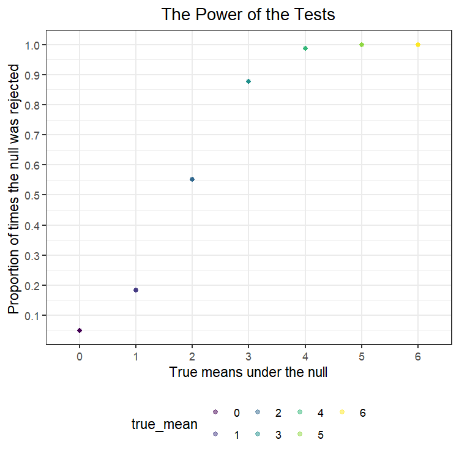
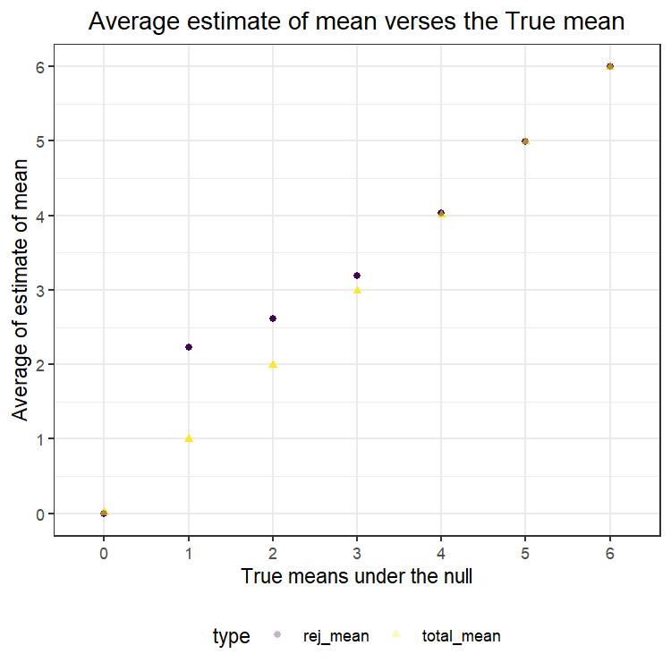

P8105: Data Science I
================
Hw5<br>Zhuodiao Kuang(UNI: zk2275)

- [Problem 1](#problem-1)
- [Problem 2](#problem-2)
- [Problem 3](#problem-3)

<!------------------------------------------------------------------------------------------
Preamble
------------------------------------------------------------------------------------------->
<!------------------------------------------------------------------------------------------
Problem 1
------------------------------------------------------------------------------------------->

# Problem 1

<!------------------------------------------------------------------------------------------
Problem 2
------------------------------------------------------------------------------------------->

# Problem 2

<!------------------------------------------------------------------------------------------
Problem 3
------------------------------------------------------------------------------------------->

# Problem 3

First, create the functions that generates the normally data and
conducts t_test:

``` r
sim_t_test = function(n = 30, mu = 0, sigma = 5){
  sim_data = tibble(
    x = rnorm(n, mean = mu, sd = sigma)
  ) 
    
  tests_data = t.test(sim_data, mu = 0, conf.level = 0.95)
  
  sim_data %>% 
    summarize(
      mu_hat =pull(broom::tidy(tests_data),estimate),
      p_val = pull(broom::tidy(tests_data),p.value)
    )
}
```

Generate and conduct t-test on each of the 5000 datasets:

``` r
results_df = 
  tibble(
    true_mean = c(0:6)
  ) %>% 
  mutate( # learnt from Ryan
    outputs_lists = map(.x = true_mean, ~rerun(5000, sim_t_test(mu = .x))),
    estimate_dfs = map(outputs_lists, bind_rows)
  ) %>% 
  select(-outputs_lists) %>% 
  unnest(estimate_dfs)
```

Make a plot showing the proportion of times the null was rejected (the
power of the test) on the y axis and the true value of mu on the x axis.

``` r
results_df %>% 
  group_by(true_mean) %>% 
  mutate(
    true_mean = as.factor(true_mean),
    total = n(),
    rej_null = sum(p_val < 0.05),
    rej_prop = rej_null/total
  ) %>%
  ggplot(aes(x = true_mean, y = rej_prop, color = true_mean, group = true_mean)) +
  geom_point(alpha = .5) +
  scale_y_continuous(n.breaks = 10) +
  ggtitle("The Power of the Tests")+
  ylab("Proportion of times the null was rejected ")+
  xlab("True means under the null")
```



**Comments:**

As the true mean increases and goes away from the 0, which is the mean
of the population distribution of our sample, the power of the test, in
other word, the proportion of times the null was rejected increased, and
getting closer and closer to 1.

Make a plot showing the average estimate of mu_hat on the y axis and the
true value of mu on the x axis and the average estimate of mu_hat only
in samples for which the null was rejected on the y axis and the true
value of mu on the x axis.

``` r
results_df %>% 
  mutate(
    true_mean = as.factor(true_mean),
    mu_bar = (mean(mu_hat)),
    rej = case_when(p_val < 0.05 ~ "reject", p_val>0.05 ~ "failed to reject" ),
    rej = as.factor(rej)
  ) %>% 
  group_by(rej, true_mean) %>% 
  mutate(
    rej_mean = mean(mu_hat)
  ) %>% 
  ungroup() %>% 
  group_by(true_mean) %>% 
  mutate(
    total_mean = mean(mu_hat)
  ) %>% 
  ungroup() %>% 
  filter(rej == "reject") %>% 
  pivot_longer(
    rej_mean:total_mean,
    names_to = "type",
    values_to = "mean"
  ) %>% 
  mutate(type = as.factor(type)) %>% 
  select(true_mean, type, mean) %>% 
  group_by(true_mean, type) %>% 
  # using a different shape of dots since there are some overlapping.
  ggplot(aes(x = true_mean, y = mean , color = type, group = type, shape = type)) +
  geom_point(alpha = .3) +
  scale_y_continuous(n.breaks = 7) +
  ggtitle("Average estimate of mean verses the True mean")+
  ylab("Average of estimate of mean") +
  xlab("True means under the null")
```



**Comments:**

As the plot above shows, the sample average of mu_hat across tests for
which the null is rejected is not approximate to the true value of mu
when the mu equals to 1, 2 and 3. Since we rejected the null, our sample
mean is far away from the mean under the null hypothesis when the sample
mean is relatively low, and the average of mean of the rejected tests is
far away from the null too.

However, when mu equals to 4,5 and 6, the rejected estimates are
approximately equal to the true value of mu since we almost reject all
tests. There is a special case when mu equals to 0, the estimate and the
true value of mu are close because negative rejected ones may offset the
effect of positive rejected estimates.
