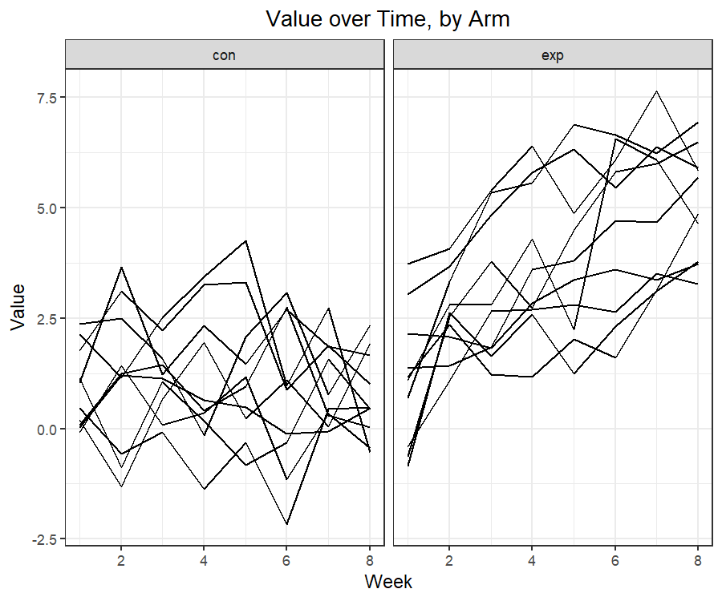

P8105: Data Science I
================
Hw5<br>Zhuodiao Kuang(UNI: zk2275)

- [Problem 1](#problem-1)
- [Problem 2](#problem-2)
- [create tidy dataset for longitudinal
  study](#create-tidy-dataset-for-longitudinal-study)
- [create a spaghetti chart of the
  data](#create-a-spaghetti-chart-of-the-data)
- [Problem 3](#problem-3)

<!------------------------------------------------------------------------------------------
Preamble
------------------------------------------------------------------------------------------->
<!------------------------------------------------------------------------------------------
Problem 1
------------------------------------------------------------------------------------------->

# Problem 1

Import the data set

``` r
path <- "https://raw.githubusercontent.com/washingtonpost/data-homicides/master/homicide-data.csv"

homicide_df = 
  read_csv(path, na = c("", "Unknown"))|>
  mutate(
    city_state = str_c(city, state, sep = ", "),
    resolved = case_when(
      disposition == "Closed without arrest" ~ "unsolved",
      disposition == "Open/No arrest"        ~ "unsolved",
      disposition == "Closed by arrest"      ~ "solved",
    )
  ) |>
  # remove a row that seems to have an error
  filter(city_state != "Tulsa, AL")
  
head(homicide_df, 10) |> knitr::kable()
```

<table>
<thead>
<tr>
<th style="text-align:left;">
uid
</th>
<th style="text-align:right;">
reported_date
</th>
<th style="text-align:left;">
victim_last
</th>
<th style="text-align:left;">
victim_first
</th>
<th style="text-align:left;">
victim_race
</th>
<th style="text-align:right;">
victim_age
</th>
<th style="text-align:left;">
victim_sex
</th>
<th style="text-align:left;">
city
</th>
<th style="text-align:left;">
state
</th>
<th style="text-align:right;">
lat
</th>
<th style="text-align:right;">
lon
</th>
<th style="text-align:left;">
disposition
</th>
<th style="text-align:left;">
city_state
</th>
<th style="text-align:left;">
resolved
</th>
</tr>
</thead>
<tbody>
<tr>
<td style="text-align:left;">
Alb-000001
</td>
<td style="text-align:right;">
20100504
</td>
<td style="text-align:left;">
GARCIA
</td>
<td style="text-align:left;">
JUAN
</td>
<td style="text-align:left;">
Hispanic
</td>
<td style="text-align:right;">
78
</td>
<td style="text-align:left;">
Male
</td>
<td style="text-align:left;">
Albuquerque
</td>
<td style="text-align:left;">
NM
</td>
<td style="text-align:right;">
35.09579
</td>
<td style="text-align:right;">
-106.5386
</td>
<td style="text-align:left;">
Closed without arrest
</td>
<td style="text-align:left;">
Albuquerque, NM
</td>
<td style="text-align:left;">
unsolved
</td>
</tr>
<tr>
<td style="text-align:left;">
Alb-000002
</td>
<td style="text-align:right;">
20100216
</td>
<td style="text-align:left;">
MONTOYA
</td>
<td style="text-align:left;">
CAMERON
</td>
<td style="text-align:left;">
Hispanic
</td>
<td style="text-align:right;">
17
</td>
<td style="text-align:left;">
Male
</td>
<td style="text-align:left;">
Albuquerque
</td>
<td style="text-align:left;">
NM
</td>
<td style="text-align:right;">
35.05681
</td>
<td style="text-align:right;">
-106.7153
</td>
<td style="text-align:left;">
Closed by arrest
</td>
<td style="text-align:left;">
Albuquerque, NM
</td>
<td style="text-align:left;">
solved
</td>
</tr>
<tr>
<td style="text-align:left;">
Alb-000003
</td>
<td style="text-align:right;">
20100601
</td>
<td style="text-align:left;">
SATTERFIELD
</td>
<td style="text-align:left;">
VIVIANA
</td>
<td style="text-align:left;">
White
</td>
<td style="text-align:right;">
15
</td>
<td style="text-align:left;">
Female
</td>
<td style="text-align:left;">
Albuquerque
</td>
<td style="text-align:left;">
NM
</td>
<td style="text-align:right;">
35.08609
</td>
<td style="text-align:right;">
-106.6956
</td>
<td style="text-align:left;">
Closed without arrest
</td>
<td style="text-align:left;">
Albuquerque, NM
</td>
<td style="text-align:left;">
unsolved
</td>
</tr>
<tr>
<td style="text-align:left;">
Alb-000004
</td>
<td style="text-align:right;">
20100101
</td>
<td style="text-align:left;">
MENDIOLA
</td>
<td style="text-align:left;">
CARLOS
</td>
<td style="text-align:left;">
Hispanic
</td>
<td style="text-align:right;">
32
</td>
<td style="text-align:left;">
Male
</td>
<td style="text-align:left;">
Albuquerque
</td>
<td style="text-align:left;">
NM
</td>
<td style="text-align:right;">
35.07849
</td>
<td style="text-align:right;">
-106.5561
</td>
<td style="text-align:left;">
Closed by arrest
</td>
<td style="text-align:left;">
Albuquerque, NM
</td>
<td style="text-align:left;">
solved
</td>
</tr>
<tr>
<td style="text-align:left;">
Alb-000005
</td>
<td style="text-align:right;">
20100102
</td>
<td style="text-align:left;">
MULA
</td>
<td style="text-align:left;">
VIVIAN
</td>
<td style="text-align:left;">
White
</td>
<td style="text-align:right;">
72
</td>
<td style="text-align:left;">
Female
</td>
<td style="text-align:left;">
Albuquerque
</td>
<td style="text-align:left;">
NM
</td>
<td style="text-align:right;">
35.13036
</td>
<td style="text-align:right;">
-106.5810
</td>
<td style="text-align:left;">
Closed without arrest
</td>
<td style="text-align:left;">
Albuquerque, NM
</td>
<td style="text-align:left;">
unsolved
</td>
</tr>
<tr>
<td style="text-align:left;">
Alb-000006
</td>
<td style="text-align:right;">
20100126
</td>
<td style="text-align:left;">
BOOK
</td>
<td style="text-align:left;">
GERALDINE
</td>
<td style="text-align:left;">
White
</td>
<td style="text-align:right;">
91
</td>
<td style="text-align:left;">
Female
</td>
<td style="text-align:left;">
Albuquerque
</td>
<td style="text-align:left;">
NM
</td>
<td style="text-align:right;">
35.15111
</td>
<td style="text-align:right;">
-106.5378
</td>
<td style="text-align:left;">
Open/No arrest
</td>
<td style="text-align:left;">
Albuquerque, NM
</td>
<td style="text-align:left;">
unsolved
</td>
</tr>
<tr>
<td style="text-align:left;">
Alb-000007
</td>
<td style="text-align:right;">
20100127
</td>
<td style="text-align:left;">
MALDONADO
</td>
<td style="text-align:left;">
DAVID
</td>
<td style="text-align:left;">
Hispanic
</td>
<td style="text-align:right;">
52
</td>
<td style="text-align:left;">
Male
</td>
<td style="text-align:left;">
Albuquerque
</td>
<td style="text-align:left;">
NM
</td>
<td style="text-align:right;">
35.11178
</td>
<td style="text-align:right;">
-106.7126
</td>
<td style="text-align:left;">
Closed by arrest
</td>
<td style="text-align:left;">
Albuquerque, NM
</td>
<td style="text-align:left;">
solved
</td>
</tr>
<tr>
<td style="text-align:left;">
Alb-000008
</td>
<td style="text-align:right;">
20100127
</td>
<td style="text-align:left;">
MALDONADO
</td>
<td style="text-align:left;">
CONNIE
</td>
<td style="text-align:left;">
Hispanic
</td>
<td style="text-align:right;">
52
</td>
<td style="text-align:left;">
Female
</td>
<td style="text-align:left;">
Albuquerque
</td>
<td style="text-align:left;">
NM
</td>
<td style="text-align:right;">
35.11178
</td>
<td style="text-align:right;">
-106.7126
</td>
<td style="text-align:left;">
Closed by arrest
</td>
<td style="text-align:left;">
Albuquerque, NM
</td>
<td style="text-align:left;">
solved
</td>
</tr>
<tr>
<td style="text-align:left;">
Alb-000009
</td>
<td style="text-align:right;">
20100130
</td>
<td style="text-align:left;">
MARTIN-LEYVA
</td>
<td style="text-align:left;">
GUSTAVO
</td>
<td style="text-align:left;">
White
</td>
<td style="text-align:right;">
56
</td>
<td style="text-align:left;">
Male
</td>
<td style="text-align:left;">
Albuquerque
</td>
<td style="text-align:left;">
NM
</td>
<td style="text-align:right;">
35.07538
</td>
<td style="text-align:right;">
-106.5535
</td>
<td style="text-align:left;">
Open/No arrest
</td>
<td style="text-align:left;">
Albuquerque, NM
</td>
<td style="text-align:left;">
unsolved
</td>
</tr>
<tr>
<td style="text-align:left;">
Alb-000010
</td>
<td style="text-align:right;">
20100210
</td>
<td style="text-align:left;">
HERRERA
</td>
<td style="text-align:left;">
ISRAEL
</td>
<td style="text-align:left;">
Hispanic
</td>
<td style="text-align:right;">
43
</td>
<td style="text-align:left;">
Male
</td>
<td style="text-align:left;">
Albuquerque
</td>
<td style="text-align:left;">
NM
</td>
<td style="text-align:right;">
35.06593
</td>
<td style="text-align:right;">
-106.5723
</td>
<td style="text-align:left;">
Open/No arrest
</td>
<td style="text-align:left;">
Albuquerque, NM
</td>
<td style="text-align:left;">
unsolved
</td>
</tr>
</tbody>
</table>

Upon filtering out a single row with a data entry issue, the dataset
consists of 52178 observations and 14 variables, two of which -
city_state and resolution - we added for convenience. Each row of the
dataset corresponds to a homicide case reported between 2007 and 2017
and includes record of the victim’s name, race/ethnicity, age, and sex.

We also have data on the location of the crime down to the latitude and
longitude, as well as whether the crime was ever solved. Across all
observations, about 50.8% of all homicides were never solved.

We aim to understand the distribution of resolution rates across cities.
To that end, we provide a table of the number of unsolved homicides and
the total number of hommicides for each city.

``` r
aggregate_df = 
  homicide_df |> 
  group_by(city_state) |> 
  summarize(
    hom_total = n(),
    hom_unsolved = sum(resolved == "unsolved")
  )
```

Do a prop test for Baltimore, MD.

``` r
# Save the output
Baltimore_prop <- prop.test(
  aggregate_df |> filter(city_state == "Baltimore, MD") |> pull(hom_unsolved), 
  aggregate_df |> filter(city_state == "Baltimore, MD") |> pull(hom_total)) 

# pull out
broom::tidy(Baltimore_prop) |> 
  # extract relevant output
  select(estimate, conf.low, conf.high)
```

    # A tibble: 1 × 3
      estimate conf.low conf.high
         <dbl>    <dbl>     <dbl>
    1    0.646    0.628     0.663

We find that in Baltimore between the years 2007 and 2017, the
proportion of homicides that went unsolved was about 64.6%, and the 95%
confidence interval around this point estimate was about \[62.8%,
66.3%\]. As we have obtained the desired output, we are now prepared to
construct a function that can generalize this procedure.

``` r
results_df = 
  aggregate_df |>
  mutate(
    prop_tests = map2(.x = hom_unsolved, .y = hom_total, ~prop.test(x = .x, n = .y)),
    tidy_tests = map(.x = prop_tests, ~broom::tidy(.x))
  ) |> 
  # extract both the proportion of unsolved homicides and the confidence interval for each
  select(-prop_tests) |> 
  unnest(tidy_tests) |> 
  select(city_state, estimate, conf.low, conf.high)

results_df |> knitr::kable()
```

<table>
<thead>
<tr>
<th style="text-align:left;">
city_state
</th>
<th style="text-align:right;">
estimate
</th>
<th style="text-align:right;">
conf.low
</th>
<th style="text-align:right;">
conf.high
</th>
</tr>
</thead>
<tbody>
<tr>
<td style="text-align:left;">
Albuquerque, NM
</td>
<td style="text-align:right;">
0.3862434
</td>
<td style="text-align:right;">
0.3372604
</td>
<td style="text-align:right;">
0.4375766
</td>
</tr>
<tr>
<td style="text-align:left;">
Atlanta, GA
</td>
<td style="text-align:right;">
0.3833505
</td>
<td style="text-align:right;">
0.3528119
</td>
<td style="text-align:right;">
0.4148219
</td>
</tr>
<tr>
<td style="text-align:left;">
Baltimore, MD
</td>
<td style="text-align:right;">
0.6455607
</td>
<td style="text-align:right;">
0.6275625
</td>
<td style="text-align:right;">
0.6631599
</td>
</tr>
<tr>
<td style="text-align:left;">
Baton Rouge, LA
</td>
<td style="text-align:right;">
0.4622642
</td>
<td style="text-align:right;">
0.4141987
</td>
<td style="text-align:right;">
0.5110240
</td>
</tr>
<tr>
<td style="text-align:left;">
Birmingham, AL
</td>
<td style="text-align:right;">
0.4337500
</td>
<td style="text-align:right;">
0.3991889
</td>
<td style="text-align:right;">
0.4689557
</td>
</tr>
<tr>
<td style="text-align:left;">
Boston, MA
</td>
<td style="text-align:right;">
0.5048860
</td>
<td style="text-align:right;">
0.4646219
</td>
<td style="text-align:right;">
0.5450881
</td>
</tr>
<tr>
<td style="text-align:left;">
Buffalo, NY
</td>
<td style="text-align:right;">
0.6122841
</td>
<td style="text-align:right;">
0.5687990
</td>
<td style="text-align:right;">
0.6540879
</td>
</tr>
<tr>
<td style="text-align:left;">
Charlotte, NC
</td>
<td style="text-align:right;">
0.2998544
</td>
<td style="text-align:right;">
0.2660820
</td>
<td style="text-align:right;">
0.3358999
</td>
</tr>
<tr>
<td style="text-align:left;">
Chicago, IL
</td>
<td style="text-align:right;">
0.7358627
</td>
<td style="text-align:right;">
0.7239959
</td>
<td style="text-align:right;">
0.7473998
</td>
</tr>
<tr>
<td style="text-align:left;">
Cincinnati, OH
</td>
<td style="text-align:right;">
0.4452450
</td>
<td style="text-align:right;">
0.4079606
</td>
<td style="text-align:right;">
0.4831439
</td>
</tr>
<tr>
<td style="text-align:left;">
Columbus, OH
</td>
<td style="text-align:right;">
0.5304428
</td>
<td style="text-align:right;">
0.5002167
</td>
<td style="text-align:right;">
0.5604506
</td>
</tr>
<tr>
<td style="text-align:left;">
Dallas, TX
</td>
<td style="text-align:right;">
0.4811742
</td>
<td style="text-align:right;">
0.4561942
</td>
<td style="text-align:right;">
0.5062475
</td>
</tr>
<tr>
<td style="text-align:left;">
Denver, CO
</td>
<td style="text-align:right;">
0.5416667
</td>
<td style="text-align:right;">
0.4846098
</td>
<td style="text-align:right;">
0.5976807
</td>
</tr>
<tr>
<td style="text-align:left;">
Detroit, MI
</td>
<td style="text-align:right;">
0.5883287
</td>
<td style="text-align:right;">
0.5687903
</td>
<td style="text-align:right;">
0.6075953
</td>
</tr>
<tr>
<td style="text-align:left;">
Durham, NC
</td>
<td style="text-align:right;">
0.3659420
</td>
<td style="text-align:right;">
0.3095874
</td>
<td style="text-align:right;">
0.4260936
</td>
</tr>
<tr>
<td style="text-align:left;">
Fort Worth, TX
</td>
<td style="text-align:right;">
0.4644809
</td>
<td style="text-align:right;">
0.4222542
</td>
<td style="text-align:right;">
0.5072119
</td>
</tr>
<tr>
<td style="text-align:left;">
Fresno, CA
</td>
<td style="text-align:right;">
0.3470226
</td>
<td style="text-align:right;">
0.3051013
</td>
<td style="text-align:right;">
0.3913963
</td>
</tr>
<tr>
<td style="text-align:left;">
Houston, TX
</td>
<td style="text-align:right;">
0.5074779
</td>
<td style="text-align:right;">
0.4892447
</td>
<td style="text-align:right;">
0.5256914
</td>
</tr>
<tr>
<td style="text-align:left;">
Indianapolis, IN
</td>
<td style="text-align:right;">
0.4493192
</td>
<td style="text-align:right;">
0.4223156
</td>
<td style="text-align:right;">
0.4766207
</td>
</tr>
<tr>
<td style="text-align:left;">
Jacksonville, FL
</td>
<td style="text-align:right;">
0.5111301
</td>
<td style="text-align:right;">
0.4820460
</td>
<td style="text-align:right;">
0.5401402
</td>
</tr>
<tr>
<td style="text-align:left;">
Kansas City, MO
</td>
<td style="text-align:right;">
0.4084034
</td>
<td style="text-align:right;">
0.3803996
</td>
<td style="text-align:right;">
0.4370054
</td>
</tr>
<tr>
<td style="text-align:left;">
Las Vegas, NV
</td>
<td style="text-align:right;">
0.4141926
</td>
<td style="text-align:right;">
0.3881284
</td>
<td style="text-align:right;">
0.4407395
</td>
</tr>
<tr>
<td style="text-align:left;">
Long Beach, CA
</td>
<td style="text-align:right;">
0.4126984
</td>
<td style="text-align:right;">
0.3629026
</td>
<td style="text-align:right;">
0.4642973
</td>
</tr>
<tr>
<td style="text-align:left;">
Los Angeles, CA
</td>
<td style="text-align:right;">
0.4900310
</td>
<td style="text-align:right;">
0.4692208
</td>
<td style="text-align:right;">
0.5108754
</td>
</tr>
<tr>
<td style="text-align:left;">
Louisville, KY
</td>
<td style="text-align:right;">
0.4531250
</td>
<td style="text-align:right;">
0.4120609
</td>
<td style="text-align:right;">
0.4948235
</td>
</tr>
<tr>
<td style="text-align:left;">
Memphis, TN
</td>
<td style="text-align:right;">
0.3190225
</td>
<td style="text-align:right;">
0.2957047
</td>
<td style="text-align:right;">
0.3432691
</td>
</tr>
<tr>
<td style="text-align:left;">
Miami, FL
</td>
<td style="text-align:right;">
0.6048387
</td>
<td style="text-align:right;">
0.5685783
</td>
<td style="text-align:right;">
0.6400015
</td>
</tr>
<tr>
<td style="text-align:left;">
Milwaukee, wI
</td>
<td style="text-align:right;">
0.3614350
</td>
<td style="text-align:right;">
0.3333172
</td>
<td style="text-align:right;">
0.3905194
</td>
</tr>
<tr>
<td style="text-align:left;">
Minneapolis, MN
</td>
<td style="text-align:right;">
0.5109290
</td>
<td style="text-align:right;">
0.4585150
</td>
<td style="text-align:right;">
0.5631099
</td>
</tr>
<tr>
<td style="text-align:left;">
Nashville, TN
</td>
<td style="text-align:right;">
0.3624511
</td>
<td style="text-align:right;">
0.3285592
</td>
<td style="text-align:right;">
0.3977401
</td>
</tr>
<tr>
<td style="text-align:left;">
New Orleans, LA
</td>
<td style="text-align:right;">
0.6485356
</td>
<td style="text-align:right;">
0.6231048
</td>
<td style="text-align:right;">
0.6731615
</td>
</tr>
<tr>
<td style="text-align:left;">
New York, NY
</td>
<td style="text-align:right;">
0.3875598
</td>
<td style="text-align:right;">
0.3494421
</td>
<td style="text-align:right;">
0.4270755
</td>
</tr>
<tr>
<td style="text-align:left;">
Oakland, CA
</td>
<td style="text-align:right;">
0.5364308
</td>
<td style="text-align:right;">
0.5040588
</td>
<td style="text-align:right;">
0.5685037
</td>
</tr>
<tr>
<td style="text-align:left;">
Oklahoma City, OK
</td>
<td style="text-align:right;">
0.4851190
</td>
<td style="text-align:right;">
0.4467861
</td>
<td style="text-align:right;">
0.5236245
</td>
</tr>
<tr>
<td style="text-align:left;">
Omaha, NE
</td>
<td style="text-align:right;">
0.4132029
</td>
<td style="text-align:right;">
0.3653146
</td>
<td style="text-align:right;">
0.4627477
</td>
</tr>
<tr>
<td style="text-align:left;">
Philadelphia, PA
</td>
<td style="text-align:right;">
0.4478103
</td>
<td style="text-align:right;">
0.4300380
</td>
<td style="text-align:right;">
0.4657157
</td>
</tr>
<tr>
<td style="text-align:left;">
Phoenix, AZ
</td>
<td style="text-align:right;">
0.5514223
</td>
<td style="text-align:right;">
0.5184825
</td>
<td style="text-align:right;">
0.5839244
</td>
</tr>
<tr>
<td style="text-align:left;">
Pittsburgh, PA
</td>
<td style="text-align:right;">
0.5340729
</td>
<td style="text-align:right;">
0.4942706
</td>
<td style="text-align:right;">
0.5734545
</td>
</tr>
<tr>
<td style="text-align:left;">
Richmond, VA
</td>
<td style="text-align:right;">
0.2634033
</td>
<td style="text-align:right;">
0.2228571
</td>
<td style="text-align:right;">
0.3082658
</td>
</tr>
<tr>
<td style="text-align:left;">
Sacramento, CA
</td>
<td style="text-align:right;">
0.3696809
</td>
<td style="text-align:right;">
0.3211559
</td>
<td style="text-align:right;">
0.4209131
</td>
</tr>
<tr>
<td style="text-align:left;">
San Antonio, TX
</td>
<td style="text-align:right;">
0.4285714
</td>
<td style="text-align:right;">
0.3947772
</td>
<td style="text-align:right;">
0.4630331
</td>
</tr>
<tr>
<td style="text-align:left;">
San Bernardino, CA
</td>
<td style="text-align:right;">
0.6181818
</td>
<td style="text-align:right;">
0.5576628
</td>
<td style="text-align:right;">
0.6753422
</td>
</tr>
<tr>
<td style="text-align:left;">
San Diego, CA
</td>
<td style="text-align:right;">
0.3796095
</td>
<td style="text-align:right;">
0.3354259
</td>
<td style="text-align:right;">
0.4258315
</td>
</tr>
<tr>
<td style="text-align:left;">
San Francisco, CA
</td>
<td style="text-align:right;">
0.5067873
</td>
<td style="text-align:right;">
0.4680516
</td>
<td style="text-align:right;">
0.5454433
</td>
</tr>
<tr>
<td style="text-align:left;">
Savannah, GA
</td>
<td style="text-align:right;">
0.4674797
</td>
<td style="text-align:right;">
0.4041252
</td>
<td style="text-align:right;">
0.5318665
</td>
</tr>
<tr>
<td style="text-align:left;">
St. Louis, MO
</td>
<td style="text-align:right;">
0.5396541
</td>
<td style="text-align:right;">
0.5154369
</td>
<td style="text-align:right;">
0.5636879
</td>
</tr>
<tr>
<td style="text-align:left;">
Stockton, CA
</td>
<td style="text-align:right;">
0.5990991
</td>
<td style="text-align:right;">
0.5517145
</td>
<td style="text-align:right;">
0.6447418
</td>
</tr>
<tr>
<td style="text-align:left;">
Tampa, FL
</td>
<td style="text-align:right;">
0.4567308
</td>
<td style="text-align:right;">
0.3881009
</td>
<td style="text-align:right;">
0.5269851
</td>
</tr>
<tr>
<td style="text-align:left;">
Tulsa, OK
</td>
<td style="text-align:right;">
0.3310463
</td>
<td style="text-align:right;">
0.2932349
</td>
<td style="text-align:right;">
0.3711192
</td>
</tr>
<tr>
<td style="text-align:left;">
Washington, DC
</td>
<td style="text-align:right;">
0.4379182
</td>
<td style="text-align:right;">
0.4112495
</td>
<td style="text-align:right;">
0.4649455
</td>
</tr>
</tbody>
</table>

Using this data frame of results, we can now better visualize the
distribution of proportions, sorted according to the point estimate of
the proportion of unsolved homicides.

``` r
# create error bar chart of rate of unsolved homicide by city
results_df |>
  # reorder cities according to point estimate of proportion
  mutate(city_state = fct_reorder(city_state, estimate)) |>
  # instantiate plot
  ggplot(aes(x = city_state, y = estimate)) +
  # add point estimates
  geom_point() +
  # add confidence intervals
  geom_errorbar(aes(ymin = conf.low, ymax = conf.high)) +
  # flip axes for readability
  coord_flip() +
  # add meta-data
  labs(
    title = "Proportion of Unsolved Homicides, by City"
    , x = "Proportion"
    , y = ""
    , caption  = paste0(
          "Note: Confidence intervals computed at the 95% cinfidence level."
        , "\nSource: The Washington Post."
    )
  )
```


Richmond, VA has the lowest rate of unsolved homicides among these 50
cities. Chicago, IL sits at the other extreme of this distribution. In
fact, as its confidence interval does not overlap with that of any other
city, it would appear to be an outlier in this sense.

<!------------------------------------------------------------------------------------------
Problem 2
------------------------------------------------------------------------------------------->

# Problem 2

We next consider (ostensibly fictional) data from a longitudinal study
that included a control arm and an experimental arm.

# create tidy dataset for longitudinal study

``` r
lda_df = 
  tibble(
    file = list.files("datasets/hw5_data/data"),
  ) %>% 
  mutate(
    path = str_c("datasets/hw5_data/data/", file),
    # read in data now
    data = map(path, read_csv)
    ) %>% 
  unnest(data) %>% 
  # extract the group and id
  mutate(
    label = str_extract(file, "(exp_[0-9][0-9]|con_[0-9][0-9])"),
  ) %>% 
  separate(
    label,
    into = c("arm","id"),
    sep = "_"
  ) %>% 
  pivot_longer(
    week_1:week_8,
    names_to = "week",
    values_to = "observations",
    names_prefix = "week_"
  ) %>% 
  mutate(
    arm = as.factor(arm),
    id = as.numeric(id),
    week = as.numeric(week),
    observations = as.numeric(observations)
  ) %>% 
  select(-file,-path)

lda_df %>%
  head(10) %>% 
  knitr::kable()
```

<table>
<thead>
<tr>
<th style="text-align:left;">
arm
</th>
<th style="text-align:right;">
id
</th>
<th style="text-align:right;">
week
</th>
<th style="text-align:right;">
observations
</th>
</tr>
</thead>
<tbody>
<tr>
<td style="text-align:left;">
con
</td>
<td style="text-align:right;">
1
</td>
<td style="text-align:right;">
1
</td>
<td style="text-align:right;">
0.20
</td>
</tr>
<tr>
<td style="text-align:left;">
con
</td>
<td style="text-align:right;">
1
</td>
<td style="text-align:right;">
2
</td>
<td style="text-align:right;">
-1.31
</td>
</tr>
<tr>
<td style="text-align:left;">
con
</td>
<td style="text-align:right;">
1
</td>
<td style="text-align:right;">
3
</td>
<td style="text-align:right;">
0.66
</td>
</tr>
<tr>
<td style="text-align:left;">
con
</td>
<td style="text-align:right;">
1
</td>
<td style="text-align:right;">
4
</td>
<td style="text-align:right;">
1.96
</td>
</tr>
<tr>
<td style="text-align:left;">
con
</td>
<td style="text-align:right;">
1
</td>
<td style="text-align:right;">
5
</td>
<td style="text-align:right;">
0.23
</td>
</tr>
<tr>
<td style="text-align:left;">
con
</td>
<td style="text-align:right;">
1
</td>
<td style="text-align:right;">
6
</td>
<td style="text-align:right;">
1.09
</td>
</tr>
<tr>
<td style="text-align:left;">
con
</td>
<td style="text-align:right;">
1
</td>
<td style="text-align:right;">
7
</td>
<td style="text-align:right;">
0.05
</td>
</tr>
<tr>
<td style="text-align:left;">
con
</td>
<td style="text-align:right;">
1
</td>
<td style="text-align:right;">
8
</td>
<td style="text-align:right;">
1.94
</td>
</tr>
<tr>
<td style="text-align:left;">
con
</td>
<td style="text-align:right;">
2
</td>
<td style="text-align:right;">
1
</td>
<td style="text-align:right;">
1.13
</td>
</tr>
<tr>
<td style="text-align:left;">
con
</td>
<td style="text-align:right;">
2
</td>
<td style="text-align:right;">
2
</td>
<td style="text-align:right;">
-0.88
</td>
</tr>
</tbody>
</table>

Each subject’s weekly values were originally stored as a row vector in
an isolated CSV file. We have tidied the data by iterating over each
file and building a singular dataset wherein each observation in the
dataset is uniquely identified by the arm type (control or
experimental), the subject ID, and the week. It is now a simple task to
visualize the trend of values over time by arm type.

# create a spaghetti chart of the data

``` r
lda_df %>%
  # instantiate plot
  ggplot(aes(x = week, y = observations, group = id)) +
  # add lines
  geom_line() +
  # create separate line charts for each arm
  facet_grid(~arm) +
  # add meta-data
  labs(
      title = "Value over Time, by Arm"
    , x     = "Week"
    , y     = "Value"
  )
```



We see that values for the control arm group trended flat, if not
slightly downward, over the course of the eight weeks of the trial.
While values for the experimental arm group generally started in the
same place as those of the control arm group, the average subject in the
experimental arm group exhibited a linear increase of almost 4 units
over the course of the trial. While not a formal statistical hypothesis
test, this visualization gives us hope that the experimental drug was
effective.

<!------------------------------------------------------------------------------------------
Problem 3
------------------------------------------------------------------------------------------->

# Problem 3
